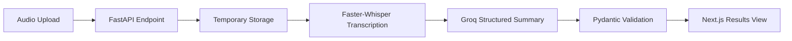

# Briefly

<div align="center">

**Turn meeting recordings into decisions, owners, and next steps.**

[](https://www.python.org/)
[](https://fastapi.tiangolo.com/)
[](https://nextjs.org/)
[](LICENSE)

Upload a meeting recording and get a concise executive summary, key decisions, action items, open questions, and the complete transcript in one place.

</div>

---

## 📋 Table of Contents

- [Features](#-features)
- [How It Works](#-how-it-works)
- [Tech Stack](#-tech-stack)
- [Prerequisites](#-prerequisites)
- [Quick Start](#-quick-start)
- [Project Structure](#-project-structure)
- [API Reference](#-api-reference)
- [Usage Guide](#-usage-guide)
- [Configuration](#-configuration)
- [Troubleshooting](#-troubleshooting)
- [Development](#-development)
- [License](#-license)

---

## ✨ Features

- **Local Transcription** - Faster-Whisper with CPU-safe defaults (no NVIDIA CUDA required by default)
- **Action-Oriented Summaries** - Groq API generates structured JSON with key decisions and action items
- **Intelligent Extraction** - Automatically identifies decisions, tasks, assignees, deadlines, and open questions
- **Simple Workflow** - Drag-and-drop upload with progress feedback and tabbed results view
- **Automatic Cleanup** - Temporary files are cleaned up after each request
- **Format Support** - MP3, WAV, M4A, MP4, MPEG, and WebM

---

## 🔄 How It Works



**Processing Flow:**

1. User uploads audio/video file via Next.js frontend
2. FastAPI receives file and stores it temporarily
3. Faster-Whisper transcribes audio locally (CPU or GPU)
4. Transcript is sent to Groq API for intelligent summarization
5. Groq returns structured JSON with decisions, action items, and questions
6. Pydantic validates the response structure
7. Results are displayed in the Next.js frontend
8. Temporary files are automatically cleaned up

**Video Demo:** [Watch Demo Video](./assets/meeting-summarizer-demo.mp4)

---

## 🛠️ Tech Stack

| Layer | Technology |
|-------|-----------|
| **Frontend** | Next.js 16, React 19, TypeScript, Tailwind CSS, Axios |
| **Backend API** | FastAPI, Uvicorn, Pydantic Settings |
| **Transcription** | Faster-Whisper 1.2.1 (local, CPU/GPU) |
| **Summarization** | Groq API (`openai/gpt-oss-120b`) |
| **Runtime** | Python 3.11+, Node.js 18+ |
| **Package Managers** | Conda or venv, npm |

---

## ✅ Prerequisites

Before you start, make sure you have:

- **Python 3.11** or newer
- **Node.js 18** or newer
- **Groq API key** ([Get one here](https://console.groq.com))
- **FFmpeg** (optional, required only for certain media formats)
- **Git** (for cloning the repository)

---

## 🚀 Quick Start

### Step 1: Clone and Setup Backend

Run these commands from the repository root:

```bash
# Create and activate Python environment
conda create -n myenv python=3.11 -y
conda activate myenv

# Install Python dependencies
pip install -r requirements.txt
```

### Step 2: Configure Backend Environment

Create a `.env` file in the repository root:

```dotenv
# Groq Configuration (Required)
GROQ_API_KEY=your_groq_api_key_here
LLM_MODEL=openai/gpt-oss-120b

# Whisper Configuration (CPU by default)
WHISPER_MODEL_SIZE=base
WHISPER_DEVICE=cpu
WHISPER_COMPUTE_TYPE=int8
```

### Step 3: Start Backend Server

```bash
conda activate myenv
uvicorn app.main:app --reload
```

✅ Backend API is running at: [http://localhost:8000](http://localhost:8000)

📖 Interactive API docs: [http://localhost:8000/docs](http://localhost:8000/docs)

### Step 4: Setup and Start Frontend

Open a **second terminal** and run:

```bash
# Navigate to frontend directory
cd frontend

# Install npm dependencies
npm install
```

Create `frontend/.env.local`:

```dotenv
NEXT_PUBLIC_API_URL=http://localhost:8000
```

Start the development server:

```bash
npm run dev
```

✅ Frontend is running at: [http://localhost:3000](http://localhost:3000)

---

## 📁 Project Structure

```
meeting-summarizer/
│
├── app/                               # FastAPI Backend Application
│   ├── core/
│   │   └── config.py                 # Environment settings & configuration
│   │
│   ├── routers/
│   │   └── meetings.py               # API endpoints (POST /process)
│   │
│   ├── schemas/
│   │   └── meeting.py                # Pydantic request/response models
│   │
│   ├── services/
│   │   ├── asr_service.py            # Faster-Whisper transcription logic
│   │   └── llm_service.py            # Groq summarization logic
│   │
│   └── main.py                       # FastAPI app initialization & CORS
│
├── frontend/                          # Next.js Frontend Application
│   ├── src/
│   │   ├── app/
│   │   │   ├── globals.css           # Global styles & animations
│   │   │   ├── layout.tsx            # Root layout & metadata
│   │   │   └── page.tsx              # Main upload & results page
│   │   │
│   │   ├── components/
│   │   │   ├── FileUpload.tsx        # Drag-and-drop upload component
│   │   │   ├── SummaryView.tsx       # Structured summary display
│   │   │   └── TranscriptView.tsx    # Full transcript display
│   │   │
│   │   └── types/
│   │       └── index.ts              # Shared TypeScript types
│   │
│   ├── public/                        # Static assets
│   ├── package.json                   # Node.js dependencies
│   ├── next.config.js                 # Next.js configuration
│   ├── tsconfig.json                  # TypeScript configuration
│   ├── tailwind.config.ts             # Tailwind CSS configuration
│   └── .env.local                     # Frontend environment (not in git)
│
├── .env                               # Backend secrets & settings (not in git)
├── .gitignore                         # Git ignore rules
├── requirements.txt                   # Python dependencies
├── README.md                          # This file
└── LICENSE                            # MIT License
```

### Key Directories Explained

| Directory | Purpose |
|-----------|---------|
| `app/core/` | Centralized configuration management |
| `app/routers/` | API endpoint definitions |
| `app/schemas/` | Request/response data models |
| `app/services/` | Business logic for transcription & summarization |
| `frontend/src/app/` | Next.js app router pages & global styles |
| `frontend/src/components/` | Reusable React components |
| `frontend/src/types/` | TypeScript type definitions |

---

## 📡 API Reference

### Process Meeting Recording

Upload and process a meeting recording to get transcript and summary.

**Endpoint:** `POST /api/v1/meetings/process`

**Content-Type:** `multipart/form-data`

**Request:**

```bash
curl -X POST "http://localhost:8000/api/v1/meetings/process" \
  -F "file=@/path/to/meeting.mp3"
```

Windows PowerShell:

```powershell
curl.exe -X POST "http://localhost:8000/api/v1/meetings/process" `
  -F "file=@C:\path\to\meeting.mp3"
```

**Response (200 OK):**

```json
{
  "meeting_id": "uuid-generated-id",
  "transcript": "Full transcription of the meeting...",
  "summary": {
    "executive_summary": "Concise overview of the meeting...",
    "key_decisions": [
      {
        "decision": "Description of decision",
        "owner": "Person responsible"
      }
    ],
    "action_items": [
      {
        "task": "Task description",
        "assignee": "Assigned person",
        "deadline": "2024-01-31"
      }
    ],
    "open_questions": [
      "Question that needs resolution"
    ]
  }
}
```

**Supported File Formats:**
- `.mp3` - MP3 Audio
- `.wav` - WAV Audio
- `.m4a` - M4A Audio
- `.mp4` - MP4 Video
- `.mpeg` - MPEG Video
- `.webm` - WebM Video

---

## 💻 Usage Guide

### Basic Workflow

1. **Open the Application**
   - Go to [http://localhost:3000](http://localhost:3000) in your browser

2. **Upload Meeting Recording**
   - Drag and drop a file into the upload panel, or click "Browse" to select
   - Supported formats: MP3, WAV, M4A, MP4, MPEG, WebM

3. **Wait for Processing**
   - See progress updates as transcription and summarization occur
   - Processing time depends on file length and system resources

4. **Review Results**
   - Click **Summary** tab to view:
     - Executive summary
     - Key decisions with owners
     - Action items with assignees and deadlines
     - Open questions
   - Click **Transcript** tab to view full transcription

5. **Process Another Meeting**
   - Click **Process New Meeting** button to start over

### Tips for Best Results

- Use clear audio with minimal background noise
- Ensure participants speak clearly and at normal pace
- For video files, ensure audio track quality is good
- Keep meeting length reasonable (< 2 hours optimal)

---

## ⚙️ Configuration

### Backend Configuration (`.env`)

```dotenv
# Groq API Settings (REQUIRED)
GROQ_API_KEY=your_groq_api_key_here
LLM_MODEL=openai/gpt-oss-120b

# Whisper Transcription Settings
WHISPER_MODEL_SIZE=base              # Options: tiny, base, small, medium, large
WHISPER_DEVICE=cpu                   # Options: cpu, cuda
WHISPER_COMPUTE_TYPE=int8            # Options: int8, int16, float16, float32

# Optional Settings
MAX_FILE_SIZE=52428800               # 50MB in bytes (optional)
UPLOAD_TIMEOUT=3600                  # Seconds (optional)
```

### Frontend Configuration (`frontend/.env.local`)

```dotenv
NEXT_PUBLIC_API_URL=http://localhost:8000
```

### Model Selection

The `LLM_MODEL` value must match a model available in your Groq account.

**List available models:**

```bash
conda run -n myenv python -c "from dotenv import load_dotenv; import os; from groq import Groq; load_dotenv(); print('\n'.join(sorted(m.id for m in Groq(api_key=os.environ['GROQ_API_KEY']).models.list().data)))"
```

**Popular Models:**
- `openai/gpt-oss-120b` (recommended, larger context)
- `mixtral-8x7b-32768` (fast, efficient)
- `gemma-7b-it` (lightweight)

### Whisper Configuration

#### CPU Mode (Default - No CUDA Required)

```dotenv
WHISPER_DEVICE=cpu
WHISPER_COMPUTE_TYPE=int8
WHISPER_MODEL_SIZE=base
```

✅ **Pros:** No CUDA libraries needed, works everywhere
❌ **Cons:** Slower processing

#### GPU Mode (NVIDIA CUDA Required)

```dotenv
WHISPER_DEVICE=cuda
WHISPER_COMPUTE_TYPE=float16
WHISPER_MODEL_SIZE=base
```

✅ **Pros:** Significantly faster
❌ **Cons:** Requires CUDA 11.8+ and compatible NVIDIA GPU

---

## 🔧 Troubleshooting

### Issue: `ModuleNotFoundError: No module named 'app'`

**Cause:** Running Uvicorn from wrong directory

**Solution:** Always run from repository root:

```bash
cd /path/to/meeting-summarizer
conda activate myenv
uvicorn app.main:app --reload
```

---

### Issue: `cublas64_12.dll is not found`

**Cause:** CUDA dependencies missing, but GPU mode is enabled

**Solution:** Switch to CPU mode in `.env`:

```dotenv
WHISPER_DEVICE=cpu
WHISPER_COMPUTE_TYPE=int8
```

Then restart Uvicorn.

---

### Issue: Groq `model_not_found` or `model_decommissioned`

**Cause:** Model specified in `.env` doesn't exist or is no longer available

**Solution:** 
1. List available models (see command above)
2. Update `LLM_MODEL` in `.env` with valid model ID
3. Restart Uvicorn

---

### Issue: CORS or Connection Errors

**Symptoms:**
- Frontend can't connect to backend
- CORS policy errors in browser console

**Solution:**
1. Confirm backend is running at `http://localhost:8000`
2. Check `frontend/.env.local` contains:
   ```dotenv
   NEXT_PUBLIC_API_URL=http://localhost:8000
   ```
3. Restart frontend dev server
4. Clear browser cache (Ctrl+Shift+Delete)

---

### Issue: Unsupported File Format

**Cause:** File extension not in supported list

**Solution:** Use one of these formats:
- `.mp3`, `.wav`, `.m4a`, `.mp4`, `.mpeg`, `.webm`

Convert using FFmpeg if needed:
```bash
ffmpeg -i input.mov -c:a aac output.m4a
```

---

### Issue: OutOfMemory or Slow Processing

**Cause:** Large file or insufficient system resources

**Solution:**
1. Use smaller model size:
   ```dotenv
   WHISPER_MODEL_SIZE=tiny  # or base
   ```
2. Close other applications
3. Increase system RAM or use smaller files
4. Consider GPU if available

---

## 🧪 Development

### Backend Checks

**Python syntax validation:**

```bash
conda run -n myenv python -m compileall -q app
```

**Run with debug output:**

```bash
conda activate myenv
uvicorn app.main:app --reload --log-level debug
```

### Frontend Checks

**Lint code:**

```bash
cd frontend
npm run lint
```

**Build for production:**

```bash
cd frontend
npm run build
npm run start
```

**Run tests (if configured):**

```bash
cd frontend
npm run test
```

### Type Checking

**Frontend TypeScript check:**

```bash
cd frontend
npx tsc --noEmit
```

---

## 📦 Dependencies

### Backend (`requirements.txt`)

```
fastapi==0.104.1
uvicorn==0.24.0
pydantic==2.5.0
pydantic-settings==2.1.0
python-dotenv==1.0.0
python-multipart==0.0.6
groq==0.4.2
faster-whisper==1.2.1
```

### Frontend (`frontend/package.json`)

- **next** - React framework
- **react** - UI library
- **typescript** - Type safety
- **tailwindcss** - Styling
- **axios** - HTTP client

---

## 🔐 Security Considerations

### Secrets Management

- ✅ Store API keys in `.env` (never in git)
- ✅ Add `.env` to `.gitignore`
- ✅ Use environment variables in production
- ❌ Never commit `.env` files to version control
- ❌ Never log API keys or sensitive data

### File Handling

- ✅ Validate file extensions before processing
- ✅ Check file sizes before upload
- ✅ Clean up temporary files after processing
- ✅ Use secure temporary directory permissions

### CORS & Production

- ✅ Configure CORS for specific origins in production
- ✅ Use HTTPS in production environments
- ✅ Implement rate limiting for API endpoints
- ✅ Sanitize user input in frontend

### API Security

```python
# Example production CORS configuration
app.add_middleware(
    CORSMiddleware,
    allow_origins=["https://yourdomain.com"],
    allow_credentials=True,
    allow_methods=["POST"],
    allow_headers=["*"],
)
```

---

## 🚀 Deployment

### Backend Deployment

**Using Gunicorn (Production):**

```bash
gunicorn -w 4 -k uvicorn.workers.UvicornWorker app.main:app
```

**Docker Option:**

```dockerfile
FROM python:3.11-slim
WORKDIR /app
COPY requirements.txt .
RUN pip install -r requirements.txt
COPY app ./app
CMD ["uvicorn", "app.main:app", "--host", "0.0.0.0", "--port", "8000"]
```

**Platforms:**
- Heroku
- Railway
- Render
- AWS EC2
- Google Cloud Run
- DigitalOcean

### Frontend Deployment

**Build for production:**

```bash
cd frontend
npm run build
npm run start
```

**Platforms:**
- Vercel (recommended for Next.js)
- Netlify
- AWS Amplify
- GitHub Pages (with static export)

**Environment Variables (Production):**

Update `NEXT_PUBLIC_API_URL` to point to your production backend:

```dotenv
NEXT_PUBLIC_API_URL=https://your-api.com
```

---

## 📄 License

This project is licensed under the **MIT License**. See [LICENSE](LICENSE) file for full details.

You are free to:
- ✅ Use commercially
- ✅ Modify the code
- ✅ Distribute copies
- ✅ Use privately

You must:
- ℹ️ Include license and copyright notice

---

## 👤 Author

**Built by Ritanshu Mahajan**

---

## 🤝 Contributing

Contributions are welcome! 

1. Fork the repository
2. Create a feature branch (`git checkout -b feature/amazing-feature`)
3. Commit your changes (`git commit -m 'Add amazing feature'`)
4. Push to the branch (`git push origin feature/amazing-feature`)
5. Open a Pull Request

---

<div align="center">

Built with ❤️ using **FastAPI** and **Next.js**

[⬆ Back to Top](#briefly)

</div>
