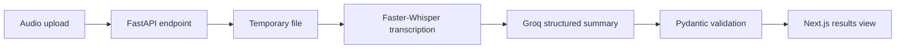

# Briefly

<div align="center">

**Turn meeting recordings into decisions, owners, and next steps.**

[](https://www.python.org/)
[](https://fastapi.tiangolo.com/)
[](https://nextjs.org/)
[](LICENSE)

Upload a meeting recording and get a concise executive summary, key decisions, action items, open questions, and the complete transcript in one place.

</div>

## What it does

- **Local transcription** with Faster-Whisper, using CPU-safe defaults out of the box.
- **Action-oriented summaries** generated by Groq with structured JSON output.
- **Useful extraction** for decisions, tasks, assignees, deadlines, and unresolved questions.
- **Simple workflow** with drag-and-drop upload, progress feedback, and summary/transcript tabs.
- **Temporary file handling** with cleanup after each request.

## How it works



The backend runs Faster-Whisper locally for speech-to-text. The transcript is then sent to Groq using the configured `LLM_MODEL`, currently `openai/gpt-oss-120b`.

## Stack

| Layer | Technology |
| --- | --- |
| Frontend | Next.js 16, React 19, TypeScript, Tailwind CSS, Axios |
| Backend | FastAPI, Uvicorn, Pydantic Settings |
| Transcription | Faster-Whisper 1.2.1 |
| Summarization | Groq API, `openai/gpt-oss-120b` |
| Environment | Python 3.11+, Node.js 18+, Conda or `venv` |

## Quick start

### Prerequisites

- Python 3.11 or newer
- Node.js 18 or newer
- A Groq API key
- FFmpeg available on your `PATH` if your local Faster-Whisper setup requires it for a media format

### 1. Configure the backend

Run these commands from the repository root. Code blocks are copy-ready and include the exact Windows workflow.

```powershell
conda create -n myenv python=3.11 -y
conda activate myenv
pip install -r requirements.txt
```

Create a root `.env` file:

```dotenv
GROQ_API_KEY=your_groq_api_key_here
LLM_MODEL=openai/gpt-oss-120b
WHISPER_MODEL_SIZE=base
WHISPER_DEVICE=cpu
WHISPER_COMPUTE_TYPE=int8
```

Start the API:

```powershell
conda activate myenv
uvicorn app.main:app --reload
```

The API is available at [http://localhost:8000](http://localhost:8000). Interactive API docs are at [http://localhost:8000/docs](http://localhost:8000/docs).

### 2. Start the frontend

Open a second terminal:

```powershell
cd frontend
npm install
```

Create `frontend/.env.local`:

```dotenv
NEXT_PUBLIC_API_URL=http://localhost:8000
```

Start Next.js:

```powershell
npm run dev
```

Open [http://localhost:3000](http://localhost:3000).

## Usage

1. Open the frontend in your browser.
2. Drop an audio or video file into the upload panel, or choose **browse**.
3. Wait for local transcription and summary generation to finish.
4. Use **Summary** for decisions and action items, or **Transcript** for the full text.
5. Choose **Process new meeting** to start again.

Supported formats: `.mp3`, `.wav`, `.m4a`, `.mp4`, `.mpeg`, and `.webm`.

## API

### Process a meeting

```http
POST /api/v1/meetings/process
Content-Type: multipart/form-data
```

Example with PowerShell:

```powershell
curl.exe -X POST "http://localhost:8000/api/v1/meetings/process" `
  -F "file=@C:\path\to\meeting.mp3"
```

The response contains:

```json
{
  "meeting_id": "generated-id",
  "transcript": "Full transcript text",
  "summary": {
    "executive_summary": "...",
    "key_decisions": [],
    "action_items": [],
    "open_questions": []
  }
}
```

## Project structure

```text
meeting-summarizer/
├── app/
│   ├── core/
│   │   └── config.py              # Environment-backed settings
│   ├── routers/
│   │   └── meetings.py            # Upload and processing endpoint
│   ├── schemas/
│   │   └── meeting.py             # Request/response models
│   ├── services/
│   │   ├── asr_service.py         # Faster-Whisper transcription
│   │   └── llm_service.py         # Groq summary generation
│   └── main.py                    # FastAPI application and CORS
├── frontend/
│   ├── src/
│   │   ├── app/
│   │   │   ├── globals.css        # Global styles and animations
│   │   │   ├── layout.tsx         # Metadata and root layout
│   │   │   └── page.tsx           # Main upload/results experience
│   │   ├── components/
│   │   │   ├── FileUpload.tsx     # Drag-and-drop upload UI
│   │   │   ├── SummaryView.tsx    # Structured meeting summary
│   │   │   └── TranscriptView.tsx # Full transcript view
│   │   └── types/
│   │       └── index.ts           # Shared frontend types
│   ├── package.json
│   └── .env.local                 # Frontend-only environment values
├── .env                           # Backend secrets and model settings
├── requirements.txt               # Python dependencies
├── README.md
└── LICENSE
```

## Configuration notes

The default transcription configuration is deliberately CPU-based:

```dotenv
WHISPER_DEVICE=cpu
WHISPER_COMPUTE_TYPE=int8
```

This avoids requiring NVIDIA CUDA libraries such as `cublas64_12.dll`. If a compatible CUDA installation is available, you can opt into GPU processing:

```dotenv
WHISPER_DEVICE=cuda
WHISPER_COMPUTE_TYPE=float16
```

The `LLM_MODEL` value must be a model available to your Groq account. List available models with:

```powershell
conda run -n myenv python -c "from dotenv import load_dotenv; import os; from groq import Groq; load_dotenv(); print('\n'.join(sorted(m.id for m in Groq(api_key=os.environ['GROQ_API_KEY']).models.list().data)))"
```

## Troubleshooting

### `ModuleNotFoundError: No module named 'app'`

Run Uvicorn from the repository root, not from `frontend`:

```powershell
cd "D:\path\to\meeting-summarizer"
conda activate myenv
uvicorn app.main:app --reload
```

### `cublas64_12.dll is not found`

Set the CPU defaults in the root `.env`, then restart the backend:

```dotenv
WHISPER_DEVICE=cpu
WHISPER_COMPUTE_TYPE=int8
```

### Groq `model_not_found` or `model_decommissioned`

Set `LLM_MODEL` to an ID returned by the model-list command above. Restart Uvicorn after changing `.env`.

### CORS or connection errors

Confirm both servers are running and that `frontend/.env.local` points to `http://localhost:8000`.

### Unsupported file format

Use one of the supported extensions listed in the Usage section. The backend validates the extension before processing.

## Development checks

Backend syntax check:

```powershell
conda run -n myenv python -m compileall -q app
```

Frontend lint and production build:

```powershell
cd frontend
npm run lint
npm run build
```

## License

This project is licensed under the MIT License. See [LICENSE](LICENSE) for details.

<div align="center">

Built by **Ritanshu Mahajan**

</div>
